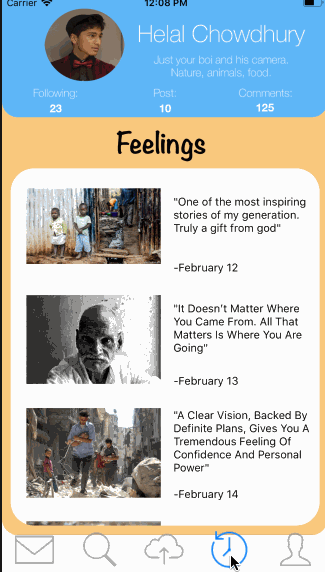
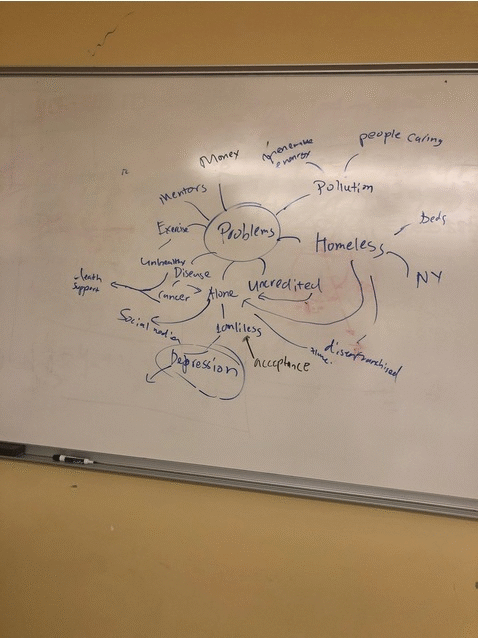

# *UpLift*

**Objective** An iOS app which builds communities around the elderly, terminally ill, and war zone civilians by sharing stories to encourage, inspire and uplift others.

## Video Walkthrough
> 

GIF created with [LiceCap](http://www.cockos.com/licecap/).

## Plan --> Prod

## Stand-Ups
- [x] (UX) Wireframes
- [x] (Team) Sprints and scrum tickets.
- [x] (UI) Instagram-Style view-controllers with respective branches
- [x] (Backend) Real-time upload and download videos (GCP)
- [ ] (Backend) Store feelings(comments) during "uplifting" moments (GCP)
- [x] (AI) Death confirmation to send public eulogy chat bot (Twilio and Heroku)
- [ ] (AI) Sentiment-Analysis disabling negative comments (Watson)
- [ ] (AI) Bot for speech-to-navigation for easier accessibility (Watson)

## Roadblocks
- **Merging** branches with iOS storyboard conflicts.
- Uploading camera video recording and **caching** for seamless scroll UX.
- Dequeuing table view cells for unlimited feed.
- Firebase and Xcode shenanigans. Restarted project 12am Sunday.

## Useful Links
- [Google Drive](https://drive.google.com/open?id=1dHydhyqqvsVpNMxRKkRf0O8zs_4H5GAJ)
- [Team Slack](https://hacknyu2019.slack.com/messages/GG8TW82EN/)
- [IBM Promo Code Instruction](https://cognitiveclass.ai/applying-ibm-cloud-promo-code/)
- [Our IBM bot environment](https://assistant-chat-us-east.watsonplatform.net/web/public/f99d0c1e-70d1-4d41-ae0f-17b78a42fb49)
- [Firebase Newsfeed](https://www.youtube.com/watch?v=Aw5Hb_A_eFI&t=625s)

## Team
Team Members:
- Matthew Rodriguez, Baruch College (Back-end)
- Helal Chowdhury, NYU (AI + Front-end) **First iOS!**
- Kevin Chen, NYU (Front-end) **First iOS!**
- Joseph Shimonov, Queens College (Front-end) **First iOS!**
- Ahmed Razin, NYU (Design UI/UX) **First iOS!**
