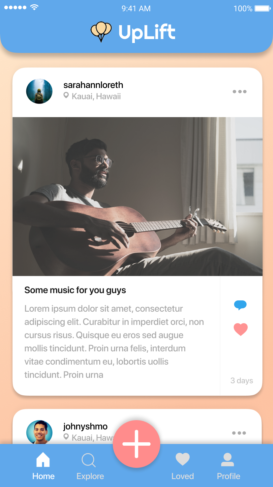
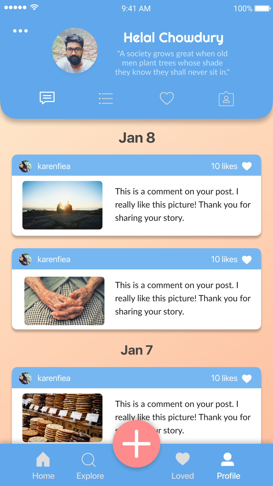

# *UpLift*

**Objective:** An iOS app which builds a community centered around our elderly, terminally ill, at risk-of-death, or those battling with mental health. Built at HackNYU, Feb 2019.

**Goal:** Build an app that best aligned with Facebook's motto: "Give people the power to build community and bring the world closer together."

**Inspiration:** Nobody wants to die with regrets or alone.  We wanted to create a platform where people at risk-of-death can document and share their life stories to encourage, inspire, and **uplift** viewers. **Uplifters** get an avenue to leave an online footprint as well to influence younger people. **Viewers** get an opportunity to get invested in the lives of other people and get inspired. Overall, we wanted to boost the emotional health of all users by encouraging an interconnected support network.

## Video Walkthrough
**Built With:** Swift, Xcode, Figma, Google Cloud Firebase, IBM Watson Assistant, Twilio

**Features:** Real-time Database Feed, Voice Assistant for Accessibility, Sentiment Analysis for filtering negative comments

The recording below showcases what we were able to accomplish in ~2 days at HackNYU:
> 

GIF created with [LiceCap](http://www.cockos.com/licecap/).

 
Youtube Demo:

## UI Design
The screens below showcase what the app would look like if we had more time to complete the app (future iterations)

## Plan --> Prod

## Stand-Ups
- [x] (UX) Wireframes
- [x] (Team) Sprints and scrum tickets.
- [x] (UI) Instagram-Style view-controllers with respective branches
- [x] (Backend) Real-time upload and download videos (GCP)
- [ ] (Backend) Store feelings(comments) during "uplifting" moments (GCP)
- [x] (AI) Death confirmation to send public eulogy chat bot (Twilio and Heroku)
- [ ] (AI) Sentiment-Analysis disabling negative comments (Watson)
- [ ] (AI) Bot for speech-to-navigation for easier accessibility (Watson)

## Roadblocks
- **Merging** branches with iOS storyboard conflicts.
- Uploading camera video recording and **caching** for seamless scroll UX.
- Dequeuing table view cells for unlimited feed.
- Firebase and Xcode shenanigans. Restarted project 12am Sunday.

## Useful Links
- [Google Drive](https://drive.google.com/open?id=1dHydhyqqvsVpNMxRKkRf0O8zs_4H5GAJ)
- [Team Slack](https://hacknyu2019.slack.com/messages/GG8TW82EN/)
- [IBM Promo Code Instruction](https://cognitiveclass.ai/applying-ibm-cloud-promo-code/)
- [Our IBM bot environment](https://assistant-chat-us-east.watsonplatform.net/web/public/f99d0c1e-70d1-4d41-ae0f-17b78a42fb49)
- [Firebase Newsfeed](https://www.youtube.com/watch?v=Aw5Hb_A_eFI&t=625s)

## Team
- Matthew Rodriguez, Baruch College (Back-end)
- Helal Chowdhury, NYU (AI + Front-end) **First time working with iOS!**
- Kevin Chen, NYU (Front-end) **First time working with iOS!**
- Joseph Shimonov, Queens College (Front-end) **First time working with iOS!**
- Ahmed Razin, NYU (Design UI/UX) **First time working with iOS!**
